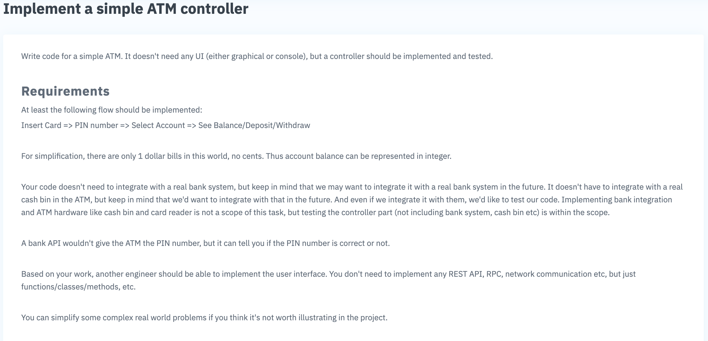
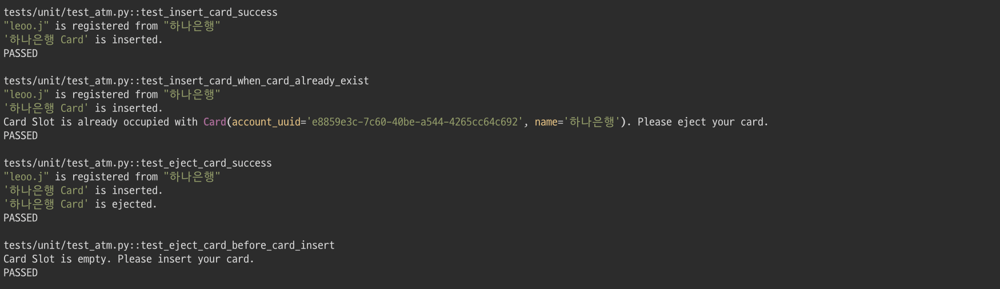
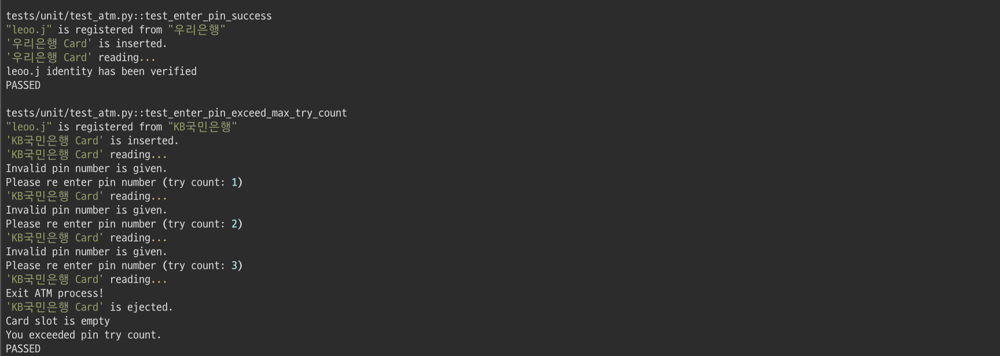
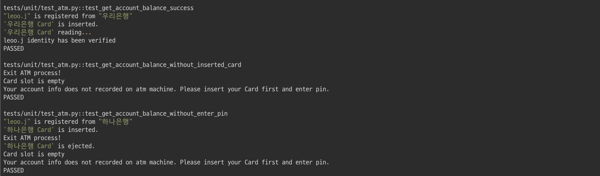
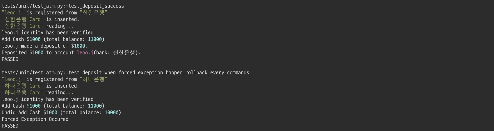
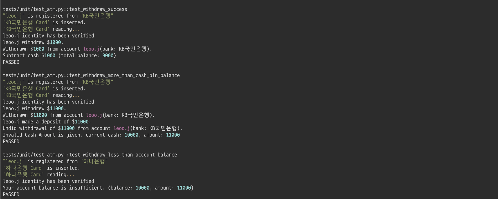
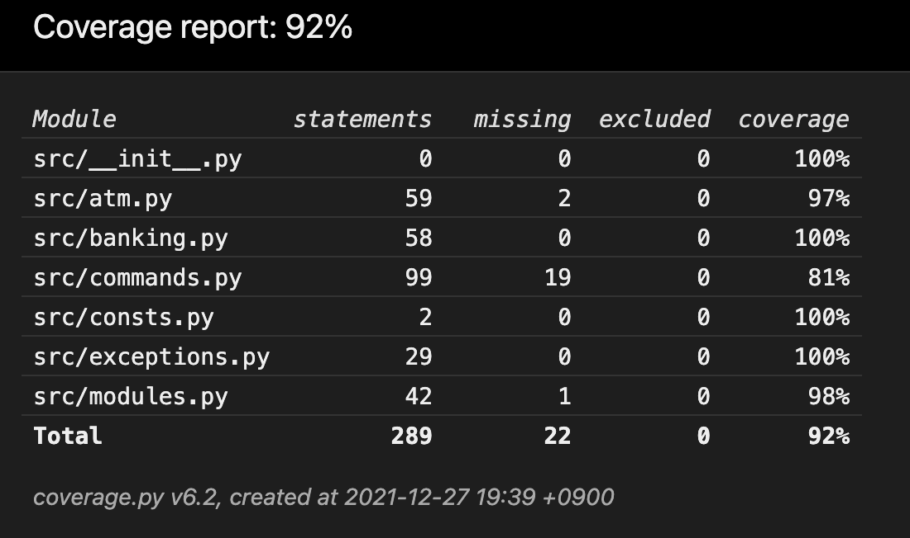

# Atm Controller
> Simple Atm controller




## 1. Run Tests

- `pipenv`
```bash
$ pipenv install --dev
$ pipenv run pytest
```

- `venv`
```bash
$ python -m venv .venv
$ . .venv/bin/activate
(.venv) $ pip3 install --upgrade pip && pip3 install -r requirements.txt --no-cache-dir
(.venv) $ pytest
```

- [pytest configuration](./pytest.ini)
- [test fixtures](./tests/conftest.py)
- [unit tests](./tests/unit/test_atm.py)

- test screen shot





- test coverate


## 2. Structure

```bash
.
├── Pipfile                 # Pipenv(package manager)
├── .pre-commit-config.yaml # Pre-commit hooks(black, flake8, mypy, reorder-imports)
├── README.md
├── pytest.ini              # Pytest configuration
├── requirements.txt        # If you do not want to use pipenv, use venv
├── src
│   ├── atm.py              # Define simple atm controller
│   ├── banking.py          # Abstract Bank system (pin, account, bank)
│   ├── commands.py         # Define "Command" and "Protocols" (command-pattern)
│   ├── consts.py           # Define constants
│   ├── exceptions.py       # Define exceptions
│   └── modules.py          # Define 3rd party hardware modules (cash_bin, card_reader)
└── tests
    ├── conftest.py         # Define common "given" data to use before testing
    ├── integration         # Integration test (bdd TODO:)
    ├── unit
    │   └── test_atm.py     # Simple atm controller unit test
    └── utils.py            # Test utils
```


## 3. Key points
- Using `command pattern` with python protocol.
- Implement `transaction` command, it can handle `undo` when exception happened.

## 4. Features
### 4-1. `Card`
- [x] Insert card
    - [x] Check already card slot is occupied (pre-insert-validation)
- [x] Eject card
    - [x] Check if card slot is empty (pre-eject-validation)
### 4-2. `Pin` (`Account`)
- [x] Enter pin number
- [x] Validate pin number
- [x] Get account from card
- [x] Allow retry of pin number entrance when wrong pin number is entered until `MAX_PIN_RETRY_COUNT`
### 4-3. `Balance`
- [x] Get current account balance
    - Check if combination of card and pin number is authorized to the account (pre-get-balance-validation)
### 4-4. `Deposit`
- [x] Add cash deposit to cash-bin
- [x] Add cash amount to current account balance
- [x] Rollback when error occurred
### 4-5. `Withdraw`
- [x] Subtract cash deposit amount from cash-bin
  - Check if cash in cash-bin is larger than requested cash withdrawal amount (pre-withdrawal check #1)
- [x] Subtract cash deposit amount from current account balance
  - Check if cash in current account balance is larger than requested cash withdrawal amount (pre-withdrawal check #2)
- [x] Rollback when error occurred
